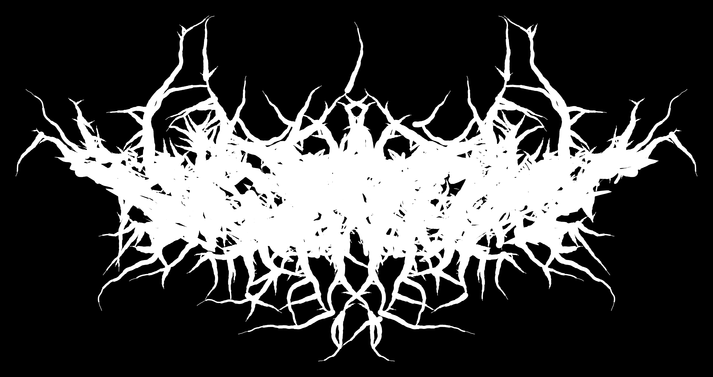
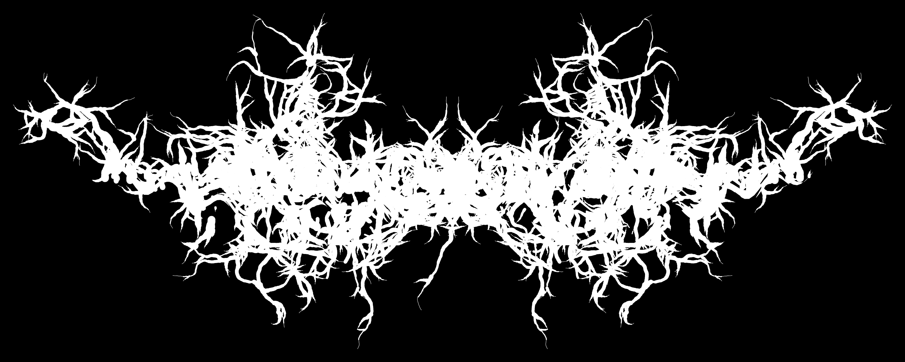
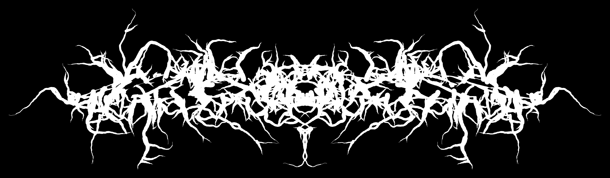
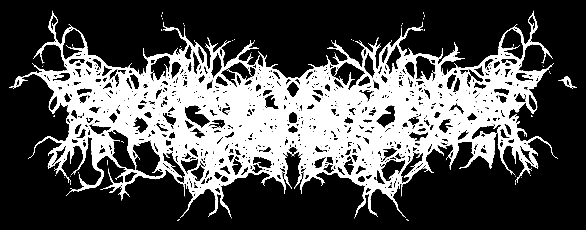
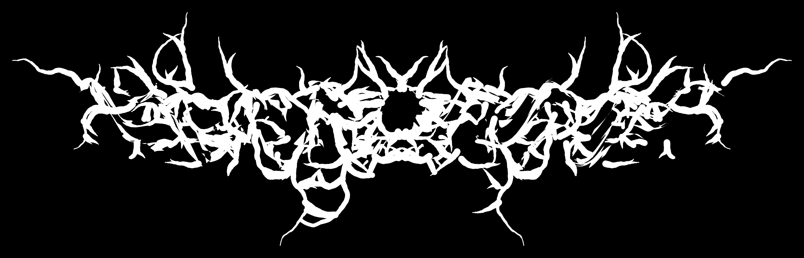

# NecroType  

<p align="center">
  
</p>

A generative design tool for death/black-metal logos. Type a band name, drag sliders, get a vector logo. Procedural, parameterized, deterministic given a seed — re-roll until you like it, then export.  

No model, no AI, no diffusion. Pure algorithm: glyph extraction → distortion → multi-pass directional extrusion → canvas-or-SVG render. Same logic that's behind the form's visual language since the late 80s, now drivable by sliders.  

## Run it  

```bash
npm install
npm run dev
```

Vite prints a local URL. First load fetches the default font from jsDelivr; subsequent loads use the browser cache.  

## Examples  

All five logos below — including the banner at the top — were generated with **nothing but the "I'm feeling heavy" button** repeatedly. No slider tweaking. Just press, re-roll the seed, press again. The button randomizes within ranges chosen to produce visually-heavy results (see [Notes](#notes) below).  

The exported PNGs are transparent (drop them straight into a poster / shirt mockup); the versions shown here are composited onto black for readable display in both GitHub themes.  

<p align="center">
  
  
</p>
<p align="center">
  
  
</p>

## How it works  

Four-stage pipeline. Each stage is a pure function — see `src/lib/`:  

1. **Glyph acquisition** (`glyphs.ts`) — opentype.js extracts cubic Bezier outlines for the chosen font + text. Flattened to dense polylines, one set per character. Cached by `(text, fontUrl, fontSize)`. Uses `charToGlyphIndex` + `glyph.getPath` directly to bypass GSUB/Bidi shaping (some fonts trip opentype.js's substitution-format support).  
2. **Per-glyph distortion** (`distort.ts`) — affine perturbation (rotation / scale / shear) + per-vertex coherent-noise displacement.  
3. **Whole-logo transform** (`transform.ts`) — global skew, vertical stretch, perspective tilt, sinusoidal wave, sinusoidal twist, applied uniformly across all glyphs.  
4. **Multi-pass directional extrusion** (`extrude.ts`) — sample roots on each contour, grow tendrils outward with curl + recursive branching. A spatial hash mediates the overlap-rejection check; tendrils respect each other and letter boundaries when overlap is below 1. Symmetry mirrors the just-grown tendril across the logo's vertical center.  

The renderer (`render-canvas.ts` for live preview, `render-svg.ts` for vector export, both honoring the same data) bins segments by stroke width and chains adjacent segments into single sub-paths so round line caps only appear at real tendril endpoints.  

## Tech stack  

- **React 19** — UI  
- **Vite 6** — dev server + build  
- **TypeScript 5.8** — strict, react-jsx  
- **Tailwind CSS v4** — styling via `@tailwindcss/vite`  
- **opentype.js 1.3** — font parsing  

No router, no state library, no MDX. Single-page tool. ~28 TypeScript files.  

## Layout  

```
necrotype/
├── index.html              # Vite entry, mounts <div id="root">
├── package.json
├── vite.config.ts
├── tsconfig*.json
├── demos/                  # sample PNG outputs (used in this README)
└── src/
    ├── main.tsx            # React entry
    ├── App.tsx             # owns params + font state
    ├── index.css           # design tokens (--accent red, dark bg, mono font)
    ├── types.ts            # Params, RenderData, Segment, ...
    │
    ├── lib/                # pure algorithm — no React
    │   ├── rng.ts          # sfc32 + gauss + expSample
    │   ├── noise.ts        # smooth value noise
    │   ├── geometry.ts     # rotate, normalize, dist, signedArea, segIntersect, ...
    │   ├── bezier.ts       # adaptive cubic + quadratic flattening
    │   ├── hash.ts         # spatial hash for overlap detection
    │   ├── glyphs.ts       # opentype.js extraction, cache, font fetch / parse
    │   ├── distort.ts      # per-glyph distortion (affine + Perlin)
    │   ├── transform.ts    # whole-logo transforms (skew / scale / persp / wave / twist)
    │   ├── extrude.ts      # multi-pass tendril growth + branching + symmetry mirror
    │   ├── render-canvas.ts# live preview + transparent PNG export
    │   ├── render-svg.ts   # flat single-path SVG export
    │   ├── pipeline.ts     # orchestrator: glyphs → distort → transform → extrude → bbox
    │   ├── budget.ts       # time-budget anti-freeze
    │   ├── fonts.ts        # curated 15-font dropdown (variable fonts URL-encoded)
    │   ├── sliders.ts      # single source of truth for slider defs + defaults
    │   └── randomize.ts    # randomize-all, feel-heavy, per-section reset
    │
    ├── hooks/
    │   ├── useFontLoader.ts     # font fetch / parse / loading / error state
    │   ├── useRenderPipeline.ts # 250 ms idle full render, immediate on font change
    │   └── useCanvasResize.ts   # debounced resize → redraw without re-pipelining
    │
    └── components/
        ├── Slider.tsx        # one labeled slider with editable numeric readout
        ├── Section.tsx       # collapsible control-panel section with optional reset
        ├── ControlPanel.tsx  # all inputs + buttons; pure props, fires callbacks
        ├── PreviewCanvas.tsx # canvas + loading overlay, fixed 11:4 aspect
        ├── LoadingOverlay.tsx
        └── DownloadMenu.tsx  # center-screen modal, SVG / transparent-PNG choice
```

## Export  

Single **Download** button → modal with two options:  

- **SVG (vector, single path)** — flat, all layers collapsed into one `<path>` with `fill-rule: nonzero`. Imports into Illustrator / Inkscape as one editable shape. Tendril strokes are converted to filled rectangles aligned with each segment. Round line caps approximate to flat — at typical stroke widths the visual delta is small, and the simpler geometry means cleaner downstream editing.  
- **PNG (transparent, 3000 px wide)** — high-resolution raster, transparent background. Drops into anything as a logo asset. Height auto-computed from the viewBox aspect ratio.  

Filename: `BAND-SEED.svg` or `BAND-SEED.png`.  

## Notes  

- **"I'm feeling heavy"** randomizes within ranges that produce visually-heavy results (high curl + symmetry + taper, mid stroke, low overlap, low branch). Per-glyph distortion + global warps are randomized across full ranges; twist is held at zero.  
- **Time budget** — at extreme parameter combos (high branch + low overlap + long tendrils) the pipeline can blow up in cost. There's a 700 ms full-render budget; if exceeded the pipeline bails with a partial result and the status bar shows `(partial — drop branch / overlap)`.  
- **Variable fonts work** — `Cinzel[wght].ttf`, `Oswald[wght].ttf`, `Merriweather[opsz,wdth,wght].ttf`, `PlayfairDisplay[wght].ttf` are loaded with URL-encoded brackets. Some fonts use OpenType GSUB substitution formats opentype.js doesn't handle natively; the glyph extractor sidesteps that path entirely.  
- **Aesthetic** mirrors the [evan_portfolio site](../../Site/evan_portfolio): black background, white text, deep red accent (`#E60012`), `ui-monospace` family, uppercase labels, hard rectangles, no rounding.  
